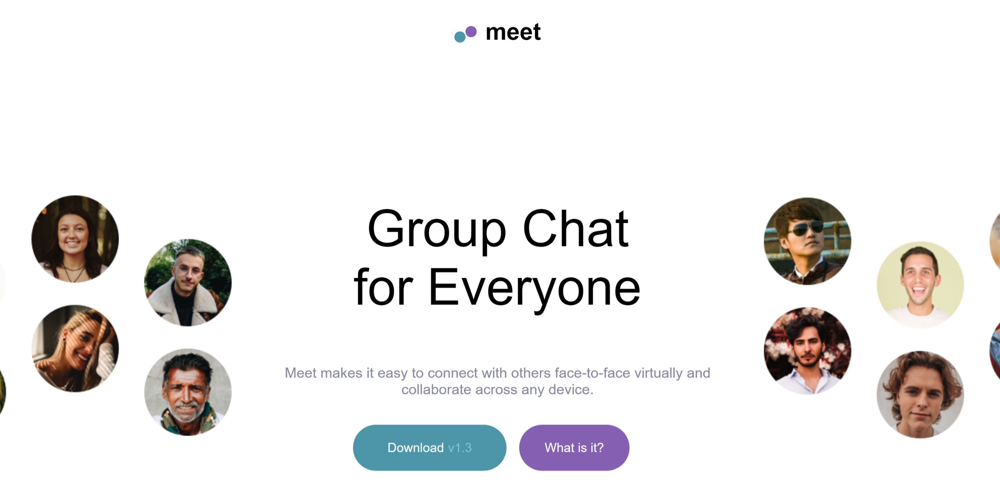

# Meet Landing Page

## Table of contents

- [Overview](#overview)
  - [The challenge](#the-challenge)
  - [Screenshot](#screenshot)
  - [Links](#links)
- [My process](#my-process)
  - [Built with](#built-with)
  - [What I learned](#what-i-learned)
  - [Continued development](#continued-development)
- [Author](#author)

**Note: Update table**

## Overview

### The challenge

Users should be able to:

- View the optimal layout depending on their device's screen size
- See hover states for interactive elements

### Screenshot



### Links

- Live Site URL: [Meet Landing Page](https://meetjason.netlify.app)

## My process

### Built with

- Semantic HTML5 markup
- CSS custom properties
- Flexbox

### What I learned

This project cued me into possibly using different presized and edited pictures instead of always alterin them in HTML5. I was able to make use of new HTML script:

```HTML
<picture>
  <source
    media="(max-width: 768px)"
    srcset="assets/tablet/image-hero.png"
  />
  <source
    media="(max-width: 1440px)"
    srcset="assets/desktop/image-hero-left.png"
  />
  
  </picture>
```

Picture functions as an if-else type statment for images that changes depending on the width of the screen. It makes it easier to edit content outside of the code and avoid spending extra time attempting to fix the structure directly in HTML5.

I typically use the flexbox to alter an object's on screen position, but had the chance to use a css grid pattern:

```css
.app__image-container {
  display: grid;
  grid-template-columns: 180px 160px;
  margin-bottom: 64px;
}
```

The code was used to take a row and change it's display into two columns creating a square with four images inside the container.

Also, it is important to set the margins and padding for the whole document to 0 and the width of the body to 100% before starting a new project.

### Continued development

Doing this project helped me to see how messy css can get. I had to constantly define the same media queries and theme color again and again. The next project I will attempt to work with SASS. SASS functions similarly to SCSS, but eliminates curly braces and uses strict spacing rules akin to a language like Python.

## Author

- Website - [Jason Nembhard](https://www.jasonnembhard.com)
- Frontend Mentor - [@jNembhard](https://www.frontendmentor.io/profile/jNembhard)
